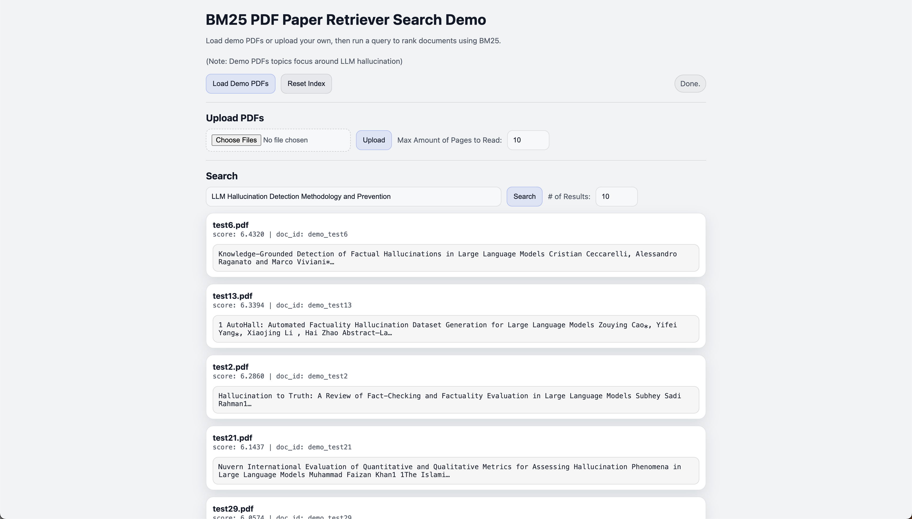

# BM25 PDF Paper Retrieval Search Demo

A small minimal FastAPI web app that lets you load a small demo corpus of PDFs (or upload your own), extract text, and search/rank documents using BM25.

## What it does

- Loads PDFs from `demo_pdfs/`
- Uploads PDFs through the web UI
- Extracts text from PDFs (works best on text-based PDFs)
- Ranks documents using BM25 and shows a short snippet near the first match
- Provides a simple one-page UI

## Dependencies

- Python 3.10+ recommended
- Packages (installed via `requirements.txt`) include:
  - `fastapi`
  - `uvicorn`
  - `pymupdf`
  - `rank-bm25`
  - `python-multipart`

## Setup

Create + activate a virtual environment:

```bash
python3 -m venv .venv
source .venv/bin/activate
```

Install dependencies:

```bash
pip install -r requirements.txt
```

Start server:
```bash
uvicorn app:app --reload --port 8000
```

Open in browser:

- UI: http://127.0.0.1:8000/

- Swagger docs: http://127.0.0.1:8000/docs

## How to use

1. (Optional) Put PDFs into demo_pdfs/. [Provided demo PDFs are about LLM Hallucination]

2. Open the UI and click Load Demo PDFs.

3. (Optional) Upload additional PDFs in the UI.

4. Enter a query and click Search.

(Note: Search runs across everything currently loaded in memory [demo PDFs + uploaded PDFs])

## Some side notes / limitations
- PDF extraction works best on text-based PDFs. Scanned/image PDFs may extract little or no text.

- BM25 is keyword-based, so it does not understand synonyms or semantic similarity.

- BM25 scores are relative (they can be positive or negative depending on corpus statistics). The ranking order output is what mainly matters.

- Uploaded files are stored in uploads/. In this demo, uploads may be cleared on server start

## Screenshots

<div align="center">
    
</div>